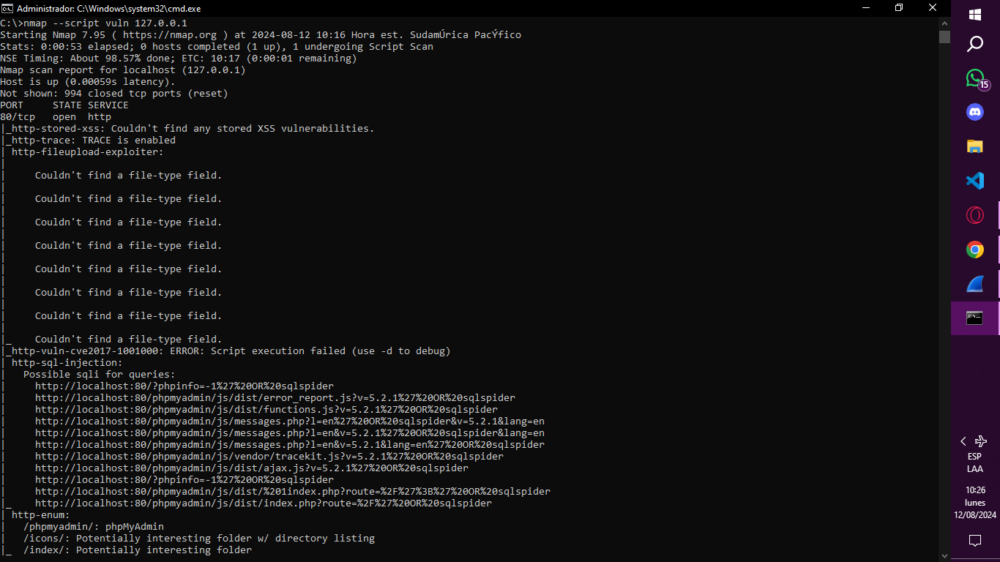
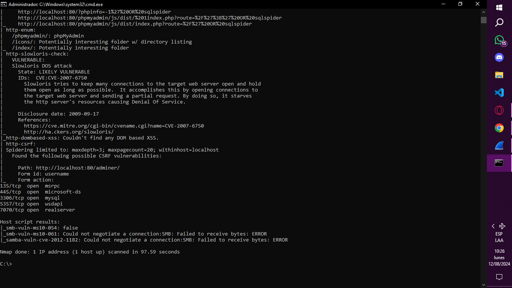
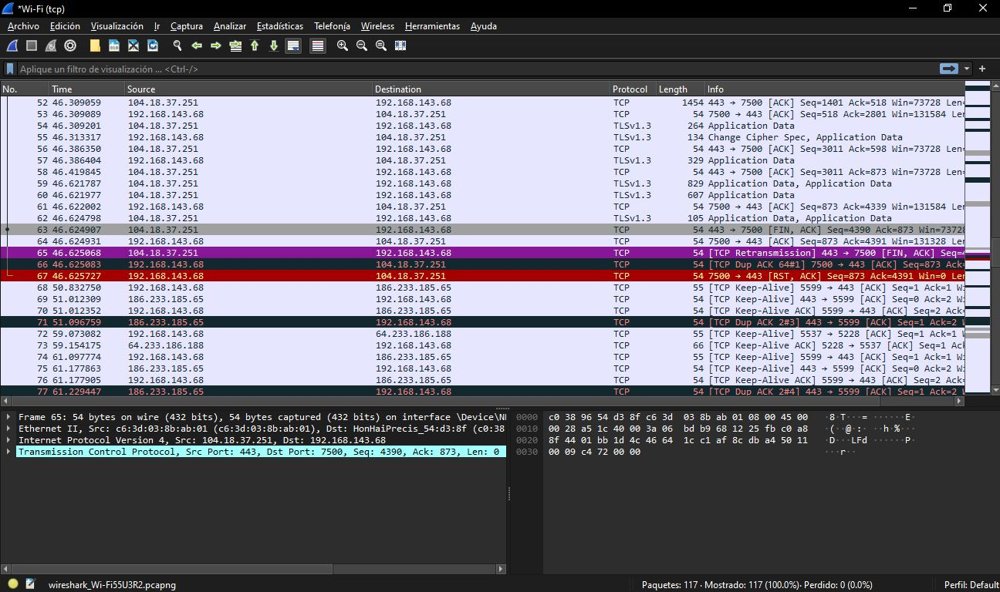
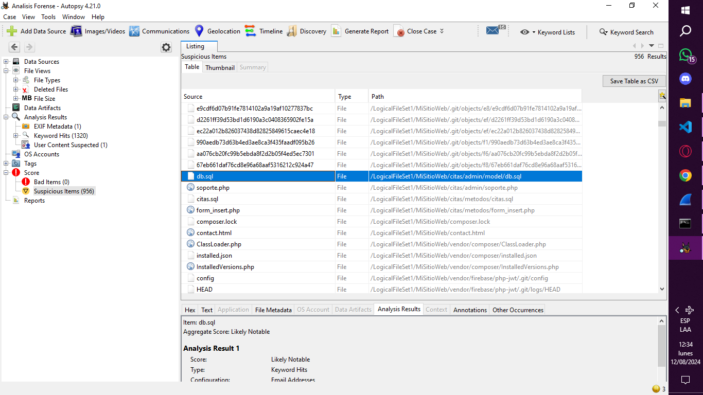
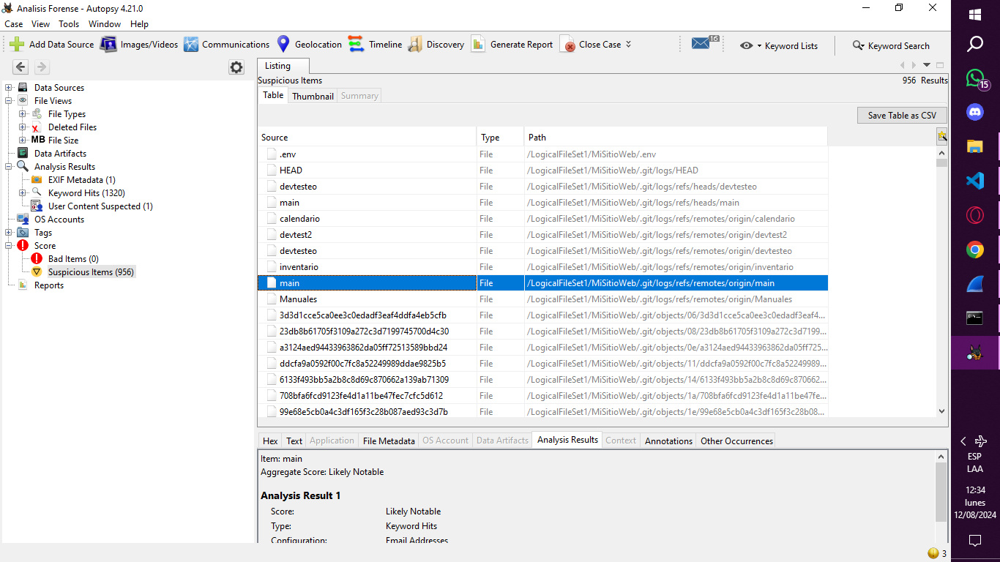
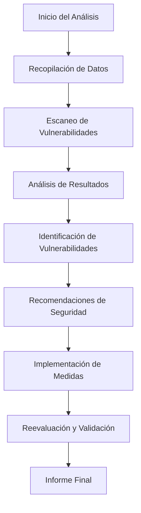

## Informe Forense
Autor: Francisca Molina  
Cargo:  Analista de Seguridad   
Contacto: fca.molinag@gmail.com     
Fecha de Elaboración: 12/08/2024
___

### Indice
+ [Resumen Ejecutivo](#resumen-ejecutivo)
+ [Introducción](#introducción)
+ [Metodología](#metodología)
+ [Hallazgos](#hallazgos)
+ [Análisis](#análisis)
+ [Conclusiones](#conclusiones)
+ [Recomendaciones](#recomendaciones)
+ [Anexos](#anexos)
___

### Resumen Ejecutivo
El objetivo del informe es presentar el análisis forense realizado en la página web www.garrasytuercas.cl para identificar y mitigar vulnerabilidades críticas en el sistema posterior a un intento de inicio de sesión no autorizado identificado el 12 de Agosto del 2024. Usando herramientas como Nmap para el escaneo de puertos, Wireshark para el análisis del tráfico de red, y Autopsy para análisis forense de los archivos, se detectaron varias vulnerabilidades significativas. Entre los hallazgos se incluyen la habilitación una función que puede facilitar ataques a traves del metodo TRACE para acceder a información sensible, así como posibles vulnerabilidades de inyección SQL que podrían comprometer la seguridad de la base de datos. También se identificaron directorios sensibles expuestos y vulnerabilidad a ataques que podrían agotar los recursos del servidor. 
Estas vulnerabilidades presentan riesgos potenciales para la integridad y seguridad del sistema, lo que subraya la necesidad de aplicar medidas correctivas para fortalecer la protección del entorno y prevenir posibles ataques. La evaluación forense ha proporcionado una visión clara de los puntos débiles del sistema y una base sólida para implementar mejoras de seguridad efectivas.
Recomendaciones y Conclusión

Para mejorar la seguridad del sistema, es necesario realizar las siguientes acciones: desactivar ciertas funciones del servidor web, proteger información sensible restringiendo el acceso a directorios importantes, y ajustar la configuración para prevenir ataques que pueden sobrecargar el sistema. Además, es importante monitorear el sistema para detectar cualquier actividad inusual. Estas medidas ayudarán a fortalecer la seguridad y reducir riesgos.

___

### Introducción
El presente informe tiene como objetivo detallar el registro de vulnerabilidades encontradas en la página posterior a un intento de vulnerabilidad en la pagina a traves del login registrado el dia 12 de Agosto del 2024. Se mencionarán a continuación herramientas utilizadas, vulnerabilidades encontradas y recomendaciones para mitigar estos riesgos.

___

### Metodología
+ Herramientas Utilizadas: 
    + Uso de Nmap para escaneo de puertos y detectar vulnerabilidades.
    + Uso de Wireshark para captura de paquetes y buscar patrones sospechosos en el tráfico de la red.
    + Uso de Autopsy para el análisis forense de la página.

+ Procedimientos y técnicas:
    + Escaneo: Se realiza escaneo con Nmap en el localhost para identificar vulnerabilidades. Se emplea el uso de scripts NSE para evaluar configuraciones específicas.
    + Análisis de tráfico: Se captura y analiza paquetes de red para identificar posibles problemas de comunicación y manejo de conexiones.
    + Análisis con Autopsy: Se analiza la imagen capturada para identificar y documentar las evidencias relacionadas con las vulnerabilidades encontradas.

___

### Hallazgos
+ Análisis de la Red 
    + Resultado del escaneo con Nmap: Puertos Abiertos: 80/tcp (HTTP), 135/tcp (MSRPC), 445/tcp (Microsoft-DS), 3306/tcp (MySQL), 5357/tcp (WSDAPI), 7070/tcp (RealServer).
    + Análisis de Wireshark: Mensaje RST, ACK: El paquete 7500 → 443 [RST, ACK] indica que el servidor o cliente está cerrando la conexión. Retransmisión TCP: El paquete [TCP Retransmission] 443 → 7500 [FIN, ACK] indica que el servidor está intentando cerrar la conexión después de una retransmisión.

    
    

    

+ Análisis de sistemas:
    + A través del análisis con Autopsy se logran identificar configuraciones inseguras en archivos de configuración y directorios expuestos, corroborando las vulnerabilidades encontradas por Nmap. 
    + Al revisar archivos y registro se revelan detalles adicionales sobre las vulnerabilidades encontradas como la exposición de datos sensibles y entradas que permiten inyección SQL.

    
    
___

### Análisis
+ En base a un intento de inicio de sesión no autorizado se realizó un análisis completo a la página, de la cual se logra desprender la siguiente información:
    + Método TRACE Habilitado: Dentro del servidor web, lo que podría permitir ataques de Cross Site Tracing (XST).
    + SQL Injection: Posibles vulnerabilidades de inyección SQL encontradas en varias URL, lo que podría derivar en ejecución de consultas maliciosas.
    + Exposición de Directorios Sensibles: Como /phpmyadmin/, que podrían exponer información crítica si no se protegen de una forma correcta.
    + Slowloris DOS Attack: El sistema es susceptible a ataques Slowloris, que pueden agotar los recursos del servidor web manteniendo muchas conexiones abiertas.
    + CSRF: Posibles vulnerabilidades de Cross-Site Request Forgery en formularios de la aplicación, específicamente en /adminer/.
    + Paquete RST, ACK: El paquete 7500 → 443 [RST, ACK] indica que la conexión ha sido cerrada por una de las partes. Esto Puede ser considerado comportamienti normal, pero puede indicar problemas en la gestión de conexiones.

+ Impacto: No se reportaron ingresos no autorizados a la página pero debido a las vulnerabilidades encontradas presenta un estado crítico que debe ser solucionado a la brevedad.

___

### Conclusiones
El análisis forense realizado logró detectar vulnerabilidades críticas que presenta el sistema gracias a la integración de herramientas como Nmap, Wireshark y Autopsy. Éstas permitieron una evaluación completa y detallada de las vulnerabilidades las cuales deben ser resueltas a la brevedad para asegurar que la página cumpla con los estándares básicos de la seguridad, manteniendo la confidencialidad, integridad y disponibilidad. La pronta solución de estos problemas es esencial para el éxito del proyecto en cuestión y para cumplir con los objetivos del Fondo Conjunto de Cooperación Chile-México en mejorar la seguridad cibernética.
___

### Recomendaciones

+ A corto plazo:
    + Deshabilitar TRACE: Configura el servidor web para deshabilitar el método TRACE para prevenir ataques de Cross Site Tracing.
    + Validar Entradas y Consultas: Implementar validaciones adecuadas y usa consultas preparadas para mitigar riesgos de inyección SQL .
    + Restringir Acceso a Directorios Sensibles: Proteger directorios sensibles para evitar la exposición de información crítica.
    + Implementar técnicas para limitar el número de conexiones simultáneas y proteger contra ataques Slowloris.
    + Implementar tokens de seguridad para proteger contra ataques CSRF. 
+ A largo plazo
    + Auditorías de Seguridad: Realizar auditorías de seguridad periódicas para lograr identificar y corregir vulnerabilidades en el sistema.
    + Monitoreo Continuo: Establecer un sistema de monitoreo continuo para detectar y responder rápidamente a actividades sospechosas.
+ Mejora en los procesos de seguridad
    + Implementar SDLC para este y futuros proyectos, para asi asegurar un desarrollo seguro desde el inicio y lograr prevenir de manera temprana vulnerabilidades en los sistemas.

### Anexos

+ Diagrama de Flujo del Análisis Realizado

[Descargar archivo de captura de Paquetes](wireshark.pcap)