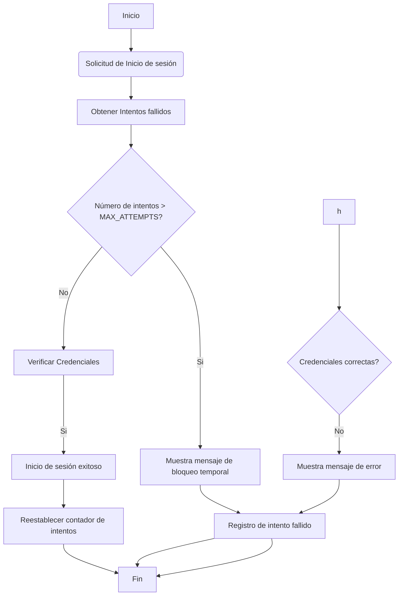

## Informe Forense
Autor: Francisca Molina  
Cargo:  Analista de Seguridad   
Contacto: fca.molinag@gmail.com     
Fecha de Elaboración: 12/08/2024
___

### Indice
+ [Resumen Ejecutivo](#resumen-ejecutivo)
+ [Introducción](#introducción)
+ [Metodología](#metodología)
+ [Hallazgos](#hallazgos)
+ [Análisis](#análisis)
+ [Conclusiones](#conclusiones)
+ [Recomendaciones](#recomendaciones)
___

### Resumen Ejecutivo
El día 09 de Agosto del 2024 a las 11:30 am se detectó un ataque de fuerza bruta dirigido a la página de inicio de sesión de garrasytuercas.cl donde un atacante intentó adivinar contraseñas de usuarios. Esto a través de un script automatizado que intenta múltiples combinaciones de credenciales con el objetivo de obtener acceso no autorizado a las cuentas, lo que permitió al atacante acceso a una cuenta durante unos segundos. El incidente fue rápidamente detectado y mitigado a través de medidas correctivas. No se reporta pérdida significativa de datos sensibles y se reforzaron las medidas de seguridad para evitar futuros ataques similares.
___

### Introducción
El presente informe tiene como objetivo detallar el registro de vulnerabilidades encontradas en la página posterior a un intento de vulnerabilidad en la pagina a traves del login. Se detallara a continuacion herramientas utilizadas, vulnerabilidades encontradas y recomendaciones para mitigar estos riesgos.
___

### Metodología
+ Herramientas Utilizadas: 
    + Uso de Nmap para escaneo de puertos y detectar vulnerabilidades.
    + Uso de Wireshark para captura de paquetes y buscar patrones sospechosos en el tráfico de la red.
    + Uso de FTK Tools para crear imagen forense y documentar la cadena de custodia.
    + Uso de Autopsy para el análisis forense de la imagen adquirida

+ Procedimientos y técnicas:
    + Escaneo: Se realiza escaneo con Nmap en el localhost para identificar vulnerabilidades. Se emplea el uso de scripts NSE para evaluar configuraciones específicas.
    + Análisis de tráfico: Se captura y analiza paquetes de red para identificar posibles problemas de comunicación y manejo de conexiones.
    + Adquisición de la imagen forense: Se adquiere una imagen del sistema en formato E01 para asegurar la integridad de los datos mediante el registro de hashes y la documentación de la cadena de custodia
    + Análisis con Autopsy: Se analiza la imagen capturada para identificar y documentar las evidencias relacionadas con las vulnerabilidades encontradas.

___

### Hallazgos
+ Análisis de la Red 
    + Resultado del escaneo con Nmap: Puertos Abiertos: 80/tcp (HTTP), 135/tcp (MSRPC), 445/tcp (Microsoft-DS), 3306/tcp (MySQL), 5357/tcp (WSDAPI), 7070/tcp (RealServer).
    + Análisis de Wireshark: Mensaje RST, ACK: El paquete 7500 → 443 [RST, ACK] indica que el servidor o cliente está cerrando la conexión. Retransmisión TCP: El paquete [TCP Retransmission] 443 → 7500 [FIN, ACK] indica que el servidor está intentando cerrar la conexión después de una retransmisión.


+ Análisis de sistemas:
    + A través de la imagen forense creada, se logran identificar configuraciones inseguras en archivos de configuración y directorios expuestos, corroborando las vulnerabilidades encontradas por Nmap. 
    + Al revisar archivos y registro se revelan detalles adicionales sobre las vulnerabilidades encontradas como la exposición de datos sensibles y entradas que permiten inyección SQL
___

### Análisis
En base a un intento de inicio de sesión no autorizado se realizó un análisis completo a la página, de la cual se logra desprender la siguiente informacion:
+ Método TRACE Habilitado: Dentro del servidor web, lo que podría permitir ataques de Cross Site Tracing (XST).
+ SQL Injection: Posibles vulnerabilidades de inyección SQL encontradas en varias URL, lo que podría derivar en ejecución de consultas maliciosas.
+ Exposición de Directorios Sensibles: Como /phpmyadmin/, que podrían exponer información crítica si no se protegen de una forma correcta.
+ Slowloris DOS Attack: El sistema es susceptible a ataques Slowloris, que pueden agotar los recursos del servidor web manteniendo muchas conexiones abiertas.
+ CSRF: Posibles vulnerabilidades de Cross-Site Request Forgery en formularios de la aplicación, específicamente en /adminer/.
+ Paquete RST, ACK: El paquete 7500 → 443 [RST, ACK] indica que la conexión ha sido cerrada por una de las partes. Esto Puede ser considerado comportamienti normal, pero puede indicar problemas en la gestión de conexiones.


Impacto: No se reportaron ingresos no autorizados a la página pero debido a las vulnerabilidades encontradas presenta un estado crítico que debe ser solucionado a la brevedad.

___

### Conclusiones
El análisis forense realizado logró detectar vulnerabilidades críticas que presenta el sistema que deben ser resueltas a la brevedad para asegurar que la página cumpla con los estándares básicos de la seguridad, manteniendo la confidencialidad, integridad y disponibilidad. La integración de herramientas como Nmap, Wireshark y Autopsy permitieron una evaluación completa y detallada de estas vulnerabilidades
___

### Recomendaciones

+ Deshabilitar TRACE: Configura el servidor web para deshabilitar el método TRACE para prevenir ataques de Cross Site Tracing.
+ Validar Entradas y Consultas: Implementar validaciones adecuadas y usa consultas preparadas para mitigar riesgos de inyección SQL .
+ Restringir Acceso a Directorios Sensibles: Proteger directorios sensibles para evitar la exposición de información crítica.
+ Implementar técnicas para limitar el número de conexiones simultáneas y proteger contra ataques Slowloris.
+ Implementar tokens de seguridad para proteger contra ataques CSRF. 
+ Auditorías de Seguridad: Realizar auditorías de seguridad periódicas para lograr identificar y corregir vulnerabilidades en el sistema.
+ Monitoreo Continuo: Establecer un sistema de monitoreo continuo para detectar y responder rápidamente a actividades sospechosas.

### Anexos

+ Extracto de código vulnerable en el login


```php
<form action="login.php" method="post">
    <div class="mb-3">
        <label for="exampleInputEmail1" class="form-label">Correo electrónico</label>
            <input type="email" name="email" class="form-control" id="exampleInputEmail1" aria-describedby="emailHelp" required>
    </div>
    <div class="mb-3">
        <label for="exampleInputPassword1" class="form-label">Contraseña</label>
            <input type="password" name="password" class="form-control" id="exampleInputPassword1" required>
    </div>
    <button type="submit" class="btn btn-primary">Iniciar Sesión</button>
</form>
```

+ Diagrama de Flujo del Ataque

