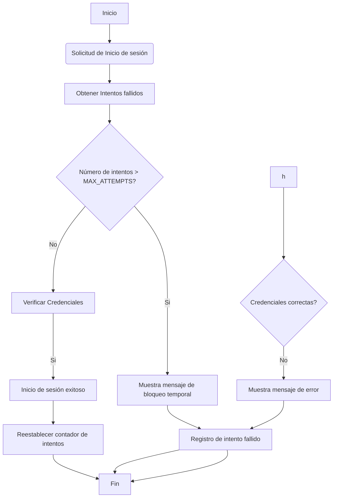

## Informe Forense
Autor: Francisca Molina  
Cargo:  Analista de Seguridad   
Contacto: fca.molinag@gmail.com     
Fecha de Elaboración: 09/08/2024
___

### Indice
+ [Resumen Ejecutivo](#resumen-ejecutivo)
+ [Introducción](#introducción)
+ [Metodología](#metodología)
+ [Hallazgos](#hallazgos)
+ [Análisis](#análisis)
+ [Conclusiones](#conclusiones)
+ [Recomendaciones](#recomendaciones)
___

### Resumen Ejecutivo
El día 09 de Agosto del 2024 a las 11:30 am se detectó un ataque de fuerza bruta dirigido a la página de inicio de sesión de garrasytuercas.cl donde un atacante intentó adivinar contraseñas de usuarios. Esto a través de un script automatizado que intenta múltiples combinaciones de credenciales con el objetivo de obtener acceso no autorizado a las cuentas, lo que permitió al atacante acceso a una cuenta durante unos segundos. El incidente fue rápidamente detectado y mitigado a través de medidas correctivas. No se reporta pérdida significativa de datos sensibles y se reforzaron las medidas de seguridad para evitar futuros ataques similares.
___

### Introducción
El presente informe tiene como objetivo detallar el incidente de seguridad ocurrido el día 09 de Agosto de 2024 donde se logró identificar un ataque de fuerza bruta contra el sistema de inicio de sesión de la página web del taller. A continuación se detallarán métodos usados, los hallazgos clave y el análisis de su impacto, para luego entregar medidas y recomendaciones de seguridad.
___

### Metodología
+ Recolección de Datos
    + Registros del servidor web para obtener datos sobre intentos de inicio de sesión.
    + Uso de Wireshark para identificar patrones sospechosos en el tráfico de la red.

+ Procedimientos:
    + Verificación de acceso a cuentas y cambios en la información de usuarios.
    + Revisión de logs para determinar origen y la frecuencia de los intentos fallidos. 
    
+ Técnicas
    + Análisis de logs, análisis de los registros de servidor.
    + Captura y análisis del tráfico de red para detectar presencia de scripts automatizados.
___

### Hallazgos
+ Evidencia digital: 
    + Se identificaron varios intentos de inicio de sesión fallidos desde una dirección IP específica en un corto período de tiempo.

    + El atacante logró acceder a una cuenta de usuario durante unos segundos, antes que se lograran implementar las medidas de mitigación.


+ Análisis de la red:
    + Se identificó un aumento en el tráfico de inicio de sesión proveniente de la dirección IP del atacante


+ Análisis de sistemas:
    + El sistema permitio múltiples intentos de inicio de sesión fallidos sin restricciones. Esta ausencia de medidas de protección como el uso de CAPTCHA, permitió al script ejecutar intentos múltiples.
___

### Análisis
Este ataque de fuerza bruta inicio a las 11:15 segun el considerable aumento de registros de inicio de sesion fallidos. A las 11:30 se detecto el ataque a traves de monitoreo de intentos fallidos y se tomaron las primeras medidas de mitigacion como la restriccion de intentos y el bloqueo de la IP del atacante. A las 11:45 se detuvo el acceso no autorizado y se confirmo que no hubo actividad sospechosa adicional.

El ataque se realizó mediante scripts automatizados que intentó numerosas combinaciones de credenciales. La falta de medidas como el uso de CAPTCHA facilitó el acceso temporal a una cuenta. 

Impacto: No se reportaron cambios significativos en la informacion de la cuenta ni en la operacion general del sistema. No se confirmo exposicion de datos sensibles y la integridad del sistema se mantuvo.
___

### Conclusiones
El ataque de fuerza bruta fue mitigado de manera efectiva y el acceso no autorizado fue controlado a la brevedad. Si bien el atacante tuvo acceso durante unos segundos a una cuenta no se reportó una exposición significativa de los datos. Las medidas correctivas fueron implementadas y han fortalecido la protección contra futuros ataques. Este incidente marcó la necesidad de mejorar la protección contra ataques automatizados.
___

### Recomendaciones

+ Implementación de CAPTCHA: Incorporar un CAPTCHA en el formulario de inicio de sesión para dificultar ataques automatizados.
+ Autenticación Multifactor: Implementación de MFA para fortalecer la seguridad de las cuentas de usuario.
+ Revisión de políticas de contraseñas: Actualizar las políticas de contraseñas para que éstas sean robustas y seguras.
+ Auditorías de Seguridad: Realizar auditorías de seguridad periódicas para lograr identificar y corregir vulnerabildiades en el sistema.
+ Monitoreo Continuo: Establecer un sistema de monitoreo continuo para detectar y responder rápidamenete a actividades sospechosas.

### Anexos

+ Extracto de código vulnerable en el login


```php
<form action="login.php" method="post">
    <div class="mb-3">
        <label for="exampleInputEmail1" class="form-label">Correo electrónico</label>
            <input type="email" name="email" class="form-control" id="exampleInputEmail1" aria-describedby="emailHelp" required>
    </div>
    <div class="mb-3">
        <label for="exampleInputPassword1" class="form-label">Contraseña</label>
            <input type="password" name="password" class="form-control" id="exampleInputPassword1" required>
    </div>
    <button type="submit" class="btn btn-primary">Iniciar Sesión</button>
</form>
```

+ Diagrama de Flujo del Ataque

